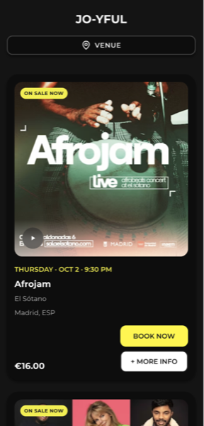
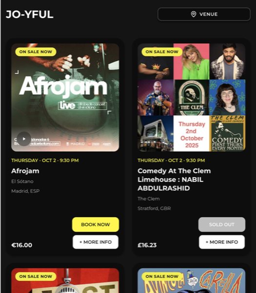
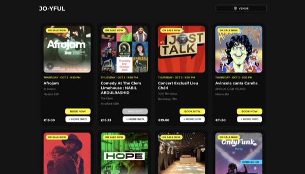
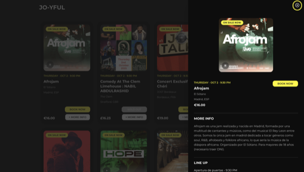

# JO-YFUL Events - DICE Tech Test

A responsive, mobile-first React application for displaying DICE events with advanced accessibility features and modern UX patterns.

## 📸 Screenshots

<div align="center">

### Mobile View


### Tablet View  


### Desktop View


### Event Drawer


</div>

## 🎯 Tech Test Implementation

This project fulfills the DICE tech test requirements:

### ✅ Core Requirements Met
- **React app** displaying DICE events at venues
- **Venue search input** with debounced auto-search
- **12 events initially** with "Load More" pagination
- **Responsive design** for desktop/tablet/mobile
- **DICE API integration** with proper authentication
- **Imgix image optimization** for performance

### ✅ Enhanced Features
- **Audio preview playback** (Spotify/Apple Music tracks)
- **Event reminders** system
- **Detailed event drawer** with full information
- **AAA accessibility compliance** (WCAG 2.2)
- **Focus management** and keyboard navigation
- **Error handling** and loading states

## 🎨 Design Decisions & Improvements

### DICE-Inspired Styling
- **Dark theme** (#2A2A2A background, #0D0D0D cards) matching DICE's aesthetic
- **Yellow-green accents** (#FFF700) for primary actions and focus states
- **Montserrat font** for modern, clean typography
- **Card-based layout** with subtle shadows and rounded corners
- **Grid system**: 1 column (mobile) → 3 columns (desktop) for optimal viewing

### UX/UI Enhancements
- **Drawer instead of expanding content** - prevents grid layout disruption and provides better mobile experience
- **Badge system** - "Featured" and "On Sale" badges for quick visual identification
- **Audio overlay** - elegant bottom strip with play button for tracks
- **Smooth animations** - slide-in drawer, hover effects, focus transitions
- **Visual hierarchy** - clear information structure with consistent spacing

## ♿ Accessibility Considerations

### WCAG 2.2 AAA Compliance
- **High contrast colors** (7:1+ ratio) for all text and interactive elements
- **Focus management** - visible focus indicators, logical tab order, focus trapping in drawer
- **Semantic HTML** - proper heading structure, button roles, form labels
- **Screen reader support** - comprehensive ARIA labels, descriptions, and live regions
- **Touch targets** - minimum 44px for mobile interactions
- **Keyboard navigation** - full app accessible via keyboard only

### Color & Visual Accessibility
- **Enhanced focus states** - bright yellow outline (#FFF700) with shadow for maximum visibility
- **Readable badges** - high contrast backgrounds with clear text
- **Consistent hover states** - subtle color changes that don't rely on color alone
- **Error prevention** - confirmation dialogs for important actions

### Technical Accessibility Features
- **Focus trapping** in drawer modal
- **Escape key** closes drawer
- **Screen reader announcements** for dynamic content
- **Form accessibility** with proper labels and descriptions
- **Alt text** for all images with context

## 🏗️ Technical Architecture

### Styling Approach
- **Sass (SCSS)** with BEM methodology for maintainable, scoped styles
- **Global variables** for colors, spacing, typography, and breakpoints
- **Reusable mixins** for responsive design, focus states, and animations
- **Component-scoped styles** for better organization and performance

### Component Structure
```
src/
├── components/
│   ├── shared/           # Reusable UI components
│   │   ├── Button/
│   │   ├── Badge/
│   │   ├── Spinner/
│   │   ├── Drawer/
│   │   ├── LoadingState/
│   │   └── NoResultsState/
│   ├── EventCard/        # Event display with subcomponents
│   │   ├── EventImage/
│   │   ├── EventInfo/
│   │   └── EventActions/
│   ├── EventDrawer/      # Detailed event view
│   ├── EventGrid/        # Responsive event grid layout
│   └── Header/           # Navigation and search
│       └── VenueSearch/
├── pages/
│   └── EventsPage/       # Main application page
├── api/
│   └── eventsApi.js      # DICE API integration
├── utils/
│   ├── audioPlayer.js    # Audio playback singleton
│   ├── currencyUtils.js  # Price formatting & calculations
│   └── errorPrevention.js # User-friendly error handling
└── styles/
    ├── _variables.scss   # Global design tokens
    ├── _mixins.scss      # Reusable styles
    └── _base.scss        # Base styles and resets
```

### State Management
- **Local component state** with React hooks (useState, useEffect, useCallback)
- **Lifted state** for global audio playback tracking across components
- **Event tracking** for reminders and bookings (session-based)
- **Debounced search** (500ms) for optimal API performance
- **User-friendly error handling** with descriptive messages

## 🧪 Testing Strategy

### Test Coverage (55 tests across 6 test files)
- **API integration** - mount calls, search functionality, error handling
- **User interactions** - button clicks, keyboard navigation, focus management
- **Conditional rendering** - badges, button states, drawer behavior
- **Accessibility** - ARIA labels, screen reader content, keyboard navigation
- **Currency utilities** - price formatting, cheapest price calculation, edge cases
- **Component behavior** - drawer open/close, debouncing, audio playback

### Testing Philosophy
- **Focus on hard-to-manual-test** functionality (API calls, focus management, accessibility)
- **Avoid testing obvious UI** that's easily verified manually
- **Semantic selectors** over class-based testing
- **Real user interactions** using Testing Library user events

## 🚀 Getting Started

### Prerequisites
- Node.js 18+ 
- npm or yarn

### Installation

1. **Clone the repository**
```bash
git clone <repository-url>
cd jo-yful-events
```

2. **Install dependencies**
```bash
npm install
```

3. **Environment setup**
Create a `.env` file in the root directory:
```bash
VITE_DICE_API_KEY=dHmvC0ZXzF4h1mWldfur13c6s4Ix6wCF4OTzozXC
```

4. **Start development server**
```bash
npm run dev
```

### Available Scripts

- `npm run dev` - Start development server
- `npm run build` - Build for production
- `npm run preview` - Preview production build
- `npm test` - Run test suite
- `npm run test:ui` - Run tests with UI
- `npm run lint` - Run ESLint

## 📱 Responsive Design

### Breakpoints
- **Mobile**: < 768px (1 column grid)
- **Tablet**: 768px - 1024px (2 column grid)  
- **Desktop**: > 1024px (3 column grid)

### Mobile-First Approach
- Base styles for mobile devices
- Progressive enhancement for larger screens
- Touch-friendly interactions (44px minimum targets)
- Optimized typography scaling

## 🔧 API Integration

### DICE API
- **Endpoint**: `https://events-api.dice.fm/v1/events`
- **Authentication**: `x-api-key` header
- **Query parameters**: `filter[venues]`, `page[size]`, `filter[date_from]`
- **Error handling**: Graceful degradation with fallback states

### Image Optimization
- **Imgix integration** for responsive images with URL parameters
- **1:1 aspect ratio** with entropy-based cropping for consistent display
- **Quality optimization** (q=80) and auto format selection
- **Lazy loading** with native browser support for performance

## 🎵 Audio Features

### Music Integration
- **Audio preview playback** for Spotify and Apple Music tracks
- **Global playback state** - only one track plays at a time
- **Visual play/pause indicators** on event cards
- **Accessible audio controls** with ARIA labels and screen reader support
- **Singleton audio player** for consistent behavior across components

## 🔐 Security & Performance

### Security
- **Environment variables** for API keys
- **Input sanitization** for search queries
- **XSS prevention** with React's built-in protections

### Performance
- **Debounced search** (500ms) to reduce API calls
- **Image lazy loading** and Imgix optimization
- **Audio singleton pattern** to manage global playback state
- **Efficient re-renders** with proper dependency arrays and useCallback


## 🎉 Final Thoughts

This tech test was a fantastic opportunity to showcase modern React development practices, accessibility-first design, and thoughtful UX decisions. I particularly enjoyed:

- **Building an accessible, inclusive experience** that works for all users
- **Implementing the drawer pattern** to maintain grid layout integrity
- **Creating comprehensive test coverage** that focuses on hard-to-manual-test functionality
- **Optimizing for performance** with debounced search and image optimization
- **Designing a cohesive DICE-inspired aesthetic** with dark themes and modern typography
- **Coming up with punny app names for the project** 

The project demonstrates not just technical competency, but also consideration for real-world users, maintainable code architecture, and attention to detail that goes beyond basic requirements.

## 🤝 Contributing

This is a tech test submission. For questions about implementation decisions or accessibility features, please refer to the inline code comments and test files or invite me for a further chat 🚀